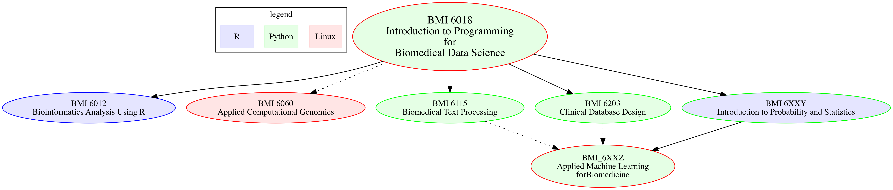

# Welcome to Introduction to Programming for Biomedical Sciences

Welcome to my class. Before we get started with the nitty gritty of a course regarding rules and expectations, I wanted to share with you my vision of why I teach this course and what I hope you will get from this course. I would also like your feedback on what you hope to gain from this course.

First, this is not simply an introduction to computer programming course. There are many options out there for you to learn the basics of how to write computer programs, many of them taught by expert educators that exceed my skills. What I hope this class adds to what you could get elsewhere includes the following:

* **Relevance to Biomedicine:** It will be most helpful to you to learn computer programming in the context of the types of data and problems that are relevant to your biomedical research or work. My own background is in clinical medical informatics and I'll be bringing data and problems from this domain to the course. Of course, biomedical science is broader than this and I ask you to bring your data and problems to the class to share them with others. We can incorporate them into homework problems and in-class problems. Most importantly, you can tackle relevant problems through a term project.

* **Computing:** In addition to learning programming with Python, We will also learn about how to work with modern computing environments (primarily based on Linux operating systems). This will include learning how to interact with operating systems through Python, how Python programs can be modified via the operating system, but also how to create customized computing environments through environment variables and virtualization tools through. We will also be learning version control (in this case, git), using UNIX/Linux shells, virtual environments, etc. While

* **Problem solving:** Most of us are trying to solve problems. We're interested in solving problems with computers, hence we are teaching or taking this class. Writing the computer programs to solve these problems introduces a new set of problems to be solved. In this class we will continually address the topic of problem solving. This will range from the nitty, gritty of **debugging** our computer programs (the process of finding out why our computer program isn't doing what we think it should be doing and changing the program so that it does what we want it to be doing) to the more general issue of learning how to solve a complex problem by breaking the problem down into smaller components or approximations and of the larger problem and solving these smaller problems and progressing towards the full problem.

In each class and with each homework assignment we will explicitly address problem solving and debugging strategies.

* **Community:** What I loved about graduate school was the interaction I had with my fellow students and sometimes with the professors. The more challenging the course, the more bonding I felt with my fellow students as we worked to learn together. **Peer instruction** is a recognized benefit of taking classes with others rather than just learning on your own. View your fellow classmates as peers not competitors.

Having me as an instructor, imperfections and all, can also be of value to you. The psychologist Sherry Turkle has written:

>One unexpected result of the online [education] experiments has been to make the value of teachers and students talking face-to-face ver more clear. A teacher "live" in from of a classroom gives students an opportunity to watch someone think, boring bits and all. That teacher is a model of how thinking happens, including false starts and hindsight.

Some of the topics we will cover in this class are things that I know well. Others I'm learning with you or just ahead of you. Hopefully, I can model for you.

I teach this class because data manipulation through computers is a fundamental aspect of many important biomedical problems. However, often the students trying to tackle these problems do not have the necessary background for this computational work. Given their biological or domain knowledge, learning programming will make them powerful problem solvers.

### Data Science

One way to view this class is through the lens of **Data Science.**

>Data Science is an interdisciplinary field about processes and systems to extract knowledge or insights from data in various forms, either structured or unstructured,[1][2] which is a continuation of some of the data analysis fields such as statistics, data mining, and predictive analytics, similar to Knowledge Discovery in Databases (KDD). ([Wikipedia](https://en.wikipedia.org/wiki/Data_science))

As the Venn diagram indicates, data science requires the ability to write programs that both do data preparation but also incorporate mathematical and statistical principles as well as domain knowledge.

#### Relationship to Other Data Science Courses in DBMI

### Computational Science and Engineering

We can use computers not only to manipulate data, but to ask questions about the data. These questions can be statistical, for example, querying for structures within the collected data. But computers can also be used to help answer hypothetical questions about the processes that generated the data via simulation. In that sense, I picture this course as a part of a larger field that is known as Computational Science and Engineering. Here is a description of this field from SIAM:

>CSE is a broad multidisciplinary area that encompasses applications in science/engineering, applied mathematics, numerical analysis, and computer science. Computer models and computer simulations have become an important part of the research repertoire, supplementing (and in some cases replacing) experimentation. Going from application area to computational results requires domain expertise, mathematical modeling, numerical analysis, algorithm development, software implementation, program execution, analysis, validation and visualization of results. CSE involves all of this....

>Although it includes elements from computer science, applied mathematics, engineering and science, CSE focuses on the integration of knowledge and methodologies from all of these disciplines, and as such is a subject which is distinct from any of them....
>CSE makes use of the techniques of applied mathematics and computer science for the development of problem-solving methodologies and robust tools which will be the building blocks for solutions to scientific and engineering problems of ever-increasing complexity. It differs from mathematics or computer science in that analysis and methodologies are directed specifically at the solution of problem classes from science and engineering, and will generally require a detailed knowledge or substantial collaboration from those disciplines. The computing and mathematical techniques used may be more domain specific, and the computer science and mathematics skills needed will be broader. ([Graduate Education for Computational Science and Engineering
SIAM Working Group on CSE Education](https://www.siam.org/students/resources/report.php))

# Suggestions for Success in this Class

## Read relevant materials before class.

* It is much easier for me to address things you don't understand during the class than it is after. Reading before hand will lead you to asking better questions in class.

## Don't procrastinate the homework.

## Work in groups.

*  You fellow students can be your best teachers. Their ignorance will often be orthogonal to your own.
* **But write your programs yourselves.**

## Make generous use of web searches

* Programming is now a lot about smart borrowing.
* **Read the documentation on [www.python.org](http://www.python.org)**
* [stackoverflow](http://stackoverflow.com/)

## Type in code examples
*  ["Learn Python the hard way"](http://learnpythonthehardway.org/book/intro.html)
* *Tinker with code:* change, break things
* *Learn to play around in IPython*

## Remember learning programming is for your benefit
* Grade is just a side effect

## Have fun

* Compete in our Programming Culture Competition
	* $20.00 price for best song, story, TV show, etc related to the class
