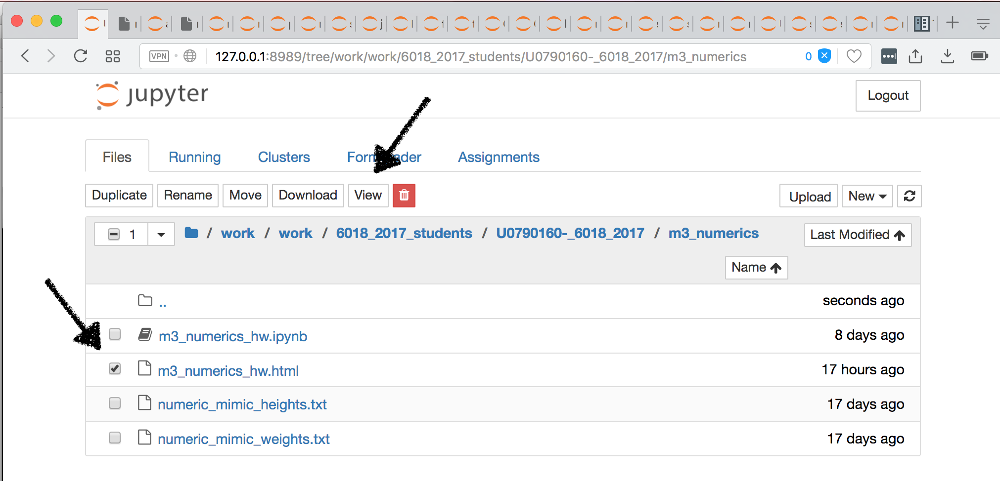
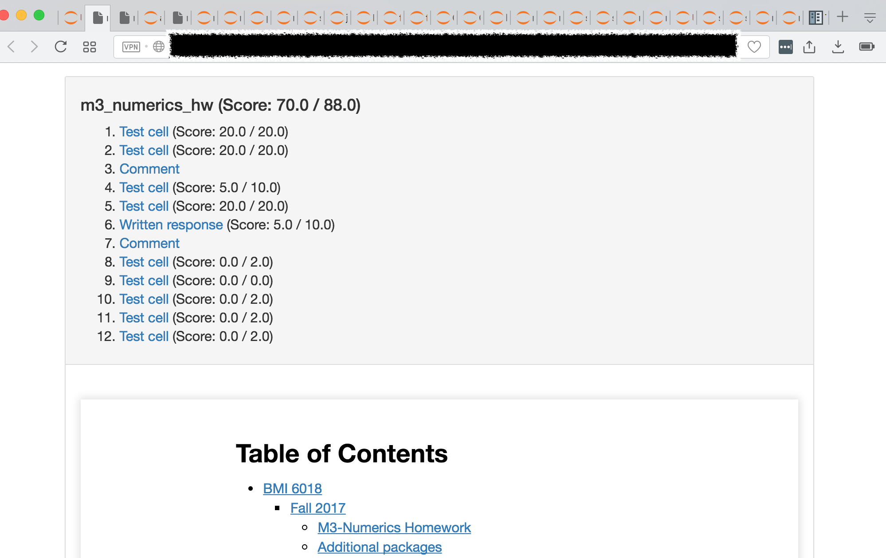
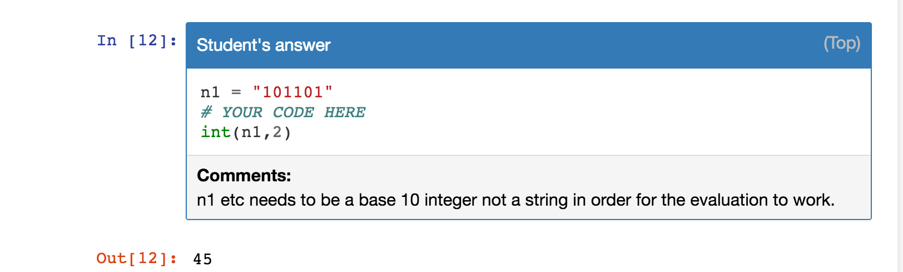

# Viewing Graded Notebook Feedback

The notebook grader software we are using generates an HTML file based on your notebook, automatic and manually graded scores, as well as any comments that we have added. GitHub will not render the HTML page; on GitHub you can only view the raw HTML. However, when you do a "git pull" in your homework repository, the HTML file will be viewable through the jupyterhub framework

The figure below illustrates how to do this.

First, click on the box to the left of the HTML file. This will bring up menu choices on the top of the page including a button (arrow) labeled "view". This button will be render the HTML page for you.

At the top of the page you will see a summary of the scoring.

As you scroll through the HTML page, there may be comments that we have added to particular problems.

